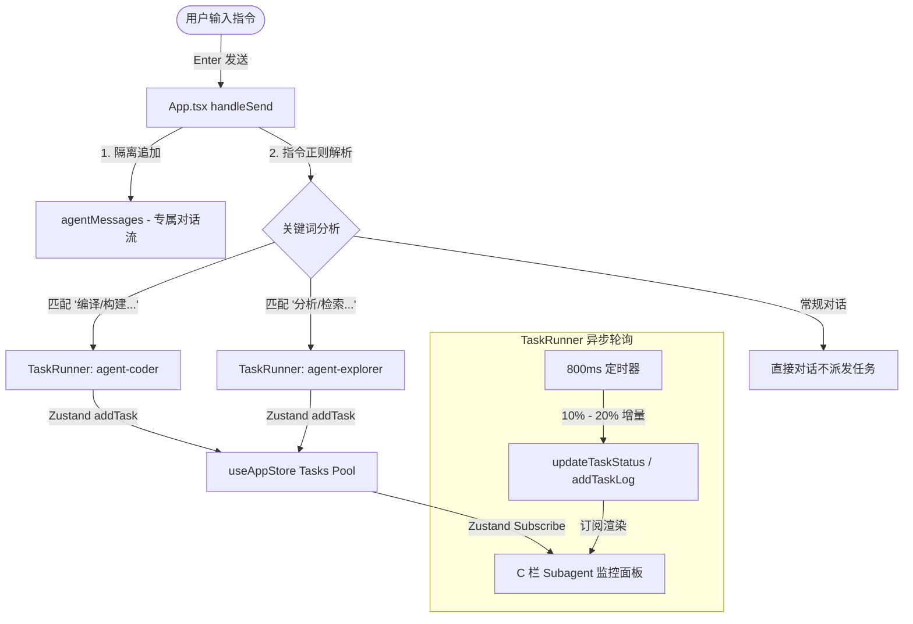

# 执行引擎与智能体联动设计架构

---

### [2026-06-15 17:59:30] 执行引擎与联动机制设计

---

## 模块概述
> 本文档定义了 MiMo One 桌面端的多智能体异步任务执行引擎（TaskRunner）的设计模式，以及中央交互舱（B 栏）与右侧监控面板（C 栏）之间基于全局状态（Zustand Store）的联动机制。该设计保证了在复杂的并发任务处理中，界面渲染的流式反馈与数据一致性。

---

## 1. 任务执行器（TaskRunner）设计模式

### 1.1 异步进度模拟机制
为了模拟真实的后台智能体运算过程，`TaskRunner` 采用异步周期的状态累加模型：
- **触发机制**：通过静态方法 `TaskRunner.runTask(agentId, taskDescription)` 直接调用。
- **状态挂载**：在 `useAppStore` 中创建初始化任务，获取其生成的唯一任务 ID。
- **定时迭代**：开启周期为 `800ms` 的计时器，每次迭代随机累加 `10% - 20%` 的进度值。
- **状态晋升**：
  - `progress < 100`：状态保持 `running`，逐步追加分析日志。
  - `progress >= 100`：状态提升为 `completed`，追加最终完成日志，并清除定时器句柄。

### 1.2 执行引擎核心代码结构
```typescript
export class TaskRunner {
  static runTask(agentId: string, taskDescription: string): void {
    // 1. 获取智能体信息并初始化任务
    const taskId = useAppStore.getState().addTask({ ... });
    // 2. 定时累加进度并追加运行日志
    const interval = setInterval(() => {
      // 进度增量逻辑
      if (progress >= 100) {
        clearInterval(interval);
        // 设为 completed
      }
    }, 800);
  }
}
```

---

## 2. 三栏数据联动机制

### 2.1 A 栏与 B 栏的上下文隔离与状态一致性
- **激活智能体点亮**：点击左侧 A 栏中的不同智能体时，更新全局 `activeAgentId`。
- **Header 状态感知**：B 栏 Header 左侧的工作区状态栏订阅 `activeAgentId`，并渲染 `(已连接: [智能体名称])` 作为反馈。
- **对话上下文隔离**：B 栏的 `messages` 从原单一数组重构为以 `agentId` 为 Key 的哈希表：`agentMessages: Record<string, Message[]>`。每次切换智能体时，交互区仅加载当前激活智能体的专属对话历史，实现上下文完全隔离。

### 2.2 B 栏指令解析向 C 栏的任务指派
当用户在 B 栏输入框发送指令并触发 `handleSend` 时，系统将解析其文本内容：
- **关键字匹配路由**：
  - **编译/构建/生成**：任务派发至 `agent-coder` (Coder 编译)，唤醒编译任务。
  - **分析/检索/搜索/定位**：任务派发至 `agent-explorer` (Explorer 检索)，唤醒检索任务。
- **任务创建与日志生成**：调用 `TaskRunner.runTask`，直接越过事件总线在 C 栏中实例化对应子智能体任务，并在后台开始进度模拟。

---

## 3. 联动数据流示意图



---
