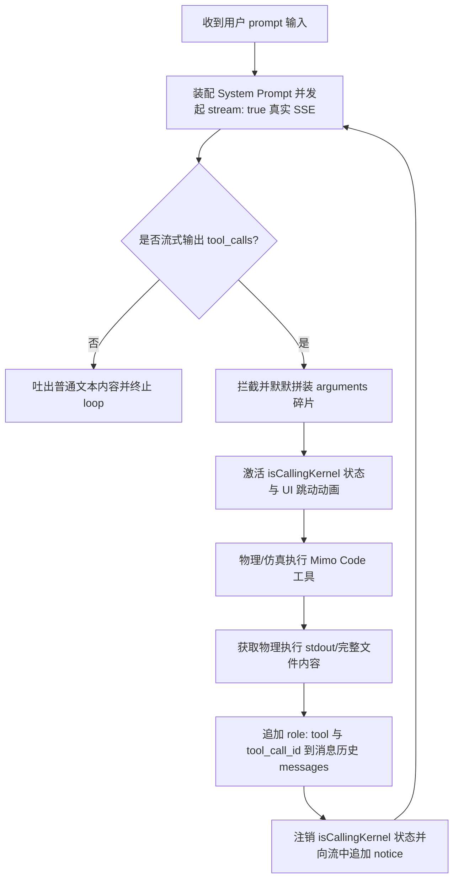

# Mimo Code 官方内核工具链与 Function Calling 协议规范说明书

---

### [2026-06-15 19:27:00] 规范初始化与实装记录

## 协议背景与价值

为了建立大模型对本地工作区（Workspace）的自主分析与构造权限，将传统粗暴的正规表达式指令拦截升级为业界标准的 OpenAI 格式工具调用（Function Calling）协议。打通 Electron 物理执行器与流式对话的内部闭环，实现“决策-拦截-执行-回传”的自动化状态机轮询。

---

## 核心物理工具定义 (Tool Schema)

> [!IMPORTANT]
> **安全与权限控制界限**：
> 物理执行器涉及主机的写入与脚本派生。对所有传入的路径参数实施强制安全防越界校验（Path Traversal 防护），绝对禁止跨出当前工作区的前缀目录 `process.cwd()`。

### 1. `read_workspace_file`
- **说明**：流式检索工作区内指定 TypeScript 或 Markdown 文件的完整文本。
- **入参格式**：
  ```json
  {
    "path": "src/App.tsx"
  }
  ```

### 2. `write_workspace_file`
- **说明**：在工作区内写入或重构代码。在物理写入完毕后，会自动提取旧有代码并同步写入全局 Zustand Store 的 `pendingDiff` 中，以在 B 区激活精美的 Git Diff 分栏高亮。
- **入参格式**：
  ```json
  {
    "path": "src/components/A-Zone/Sidebar.tsx",
    "content": "..."
  }
  ```

### 3. `execute_terminal_command`
- **说明**：在工作区的本地终端以子进程形式运行编译、安装或测试。通过拦截 `mimo-status` 日志回传来阻塞流直到进程彻底结束，并聚合 stdout 输出以供模型二次分析。
- **入参格式**：
  ```json
  {
    "command": "npm run build"
  }
  ```

---

## 多轮对话状态机调度设计 (Tool Call Loop)

多轮循环逻辑部署在 [llmService.ts](file:///d:/MiMo%20One/src/services/llmService.ts) 的 `fetchAgentResponse` 处理器中：



---

## 降级与兼容方案

1. **Electron 桌面端**：直接通过安全的 contextBridge 调用 `read-workspace-file`、`write-workspace-file` 以及物理子进程执行。
2. **Web 浏览器沙箱**：当未检测到 `electron` 通道时，自动切入仿真降级状态。在内存中对 `workspaceFiles` 实施状态维护，通过 timed interval 模拟子进程进度，使得即使在没有 Node 物理盘的纯前端也能完成完整的工具链及 Diff 对照的交互演示。
