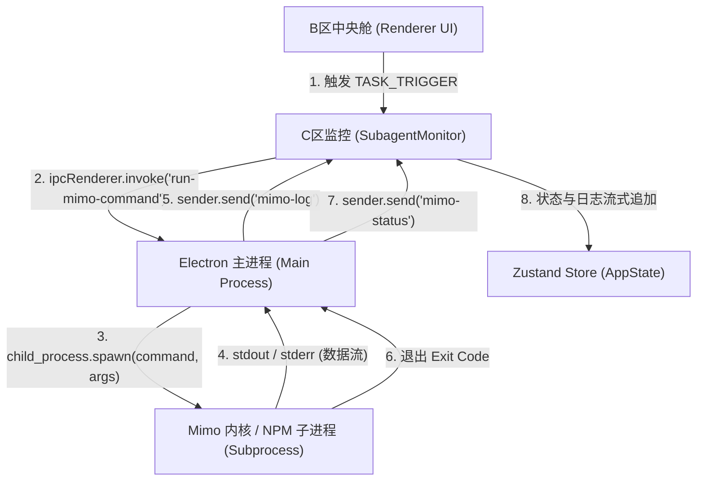

# Mimo Code 原生内核集成与进程隔离策略规范

---

### [2026-06-15 18:52:00] 内核集成与安全策略

## 内核集成架构概述

为了赋予系统本地多智能体代码编译、工程检索以及真实用例诊断的能力，我们在 Electron 主进程中集成了原生的 Mimo Code 核心调度器。

> 本集成遵循 Electron 沙箱隔离的最佳实践：渲染进程仅负责状态驱动与 UI 展现，任何物理子进程（spawn）的唤起和执行监控都必须在主进程沙箱中严格受控地执行。

---

## 进程调度拓扑结构 (Process Topology)

系统通过底层的 IPC 管道作为控制流与数据流的唯一桥梁。具体拓扑结构设计如下：



---

## 安全隔离与防御策略 (Security Sandbox Policy)

为了防止恶意指令注入以及资源死锁，设计中强制实装了四重安全隔离屏障：

### 1. 进程权限彻底解耦 (Privilege Separation)
- **渲染器沙箱化**：前端渲染进程锁死在沙箱内部，`nodeIntegration` 设为 `false`，`contextIsolation` 设为 `true`。渲染层无法直接调用 Node.js 原生的 `child_process` 模块，消除了外部代码通过对话舱控制主机的潜在风险。
- **IPC 管道白名单**：在预加载层（`preload.js`）仅向外暴露特定且经过消毒的 `'run-mimo-command'` 和 `'kill-mimo-command'` 方法。

---

### 2. 60秒硬性超时断路器 (Timeout Circuit Breaker)
- **死锁防护**：子进程在启动时会注册一个全局的硬性超时定时器（60,000 毫秒）。
  
> **断路器熔断逻辑**：若进程执行时间超出 60 秒限额，主进程执行引擎将通过 `SIGKILL` 强行击毙该子进程，回收系统文件句柄，并将前端状态置为 `failed`，彻底预防因第三方指令阻塞导致的进程死锁与内存积压。

---

### 3. 系统环境变量安全注入 (Secure Env Propagation)
- **透传继承**：主进程通过 `env: { ...process.env }` 将当前会话的环境变量注入到子进程中。
- **密钥安全防泄漏**：大模型 API 密钥（如 `OPENAI_API_KEY`, `ANTHROPIC_API_KEY`）在进程启动时由操作系统内存直接向下注入，前端不存留任何明文的密钥文件，防范本地凭证刺探风险。

---

### 4. 退出码精确状态映射 (Exit Code Mapping)
- **正常退出 (0)**：将任务状态变更为 `completed` (已完成)，并将进度百分比强制推至 100%。
- **异常退出 (非 0)**：将任务状态变更为 `failed` (已失败)，同时将退出码记录在终端日志中，为开发人员提供精确的诊断支撑。

---

### [2026-06-15 19:00:20] ANSI 颜色控制码过滤与解析方案

## 问题背景
原生终端输出（如 `npm run build` 打包结果）会携带大量 ANSI 转义字符（例如样式、前景/背景颜色控制码），这在渲染层以纯文本展示时表现为非 ASCII 乱码（如 `[32m`, `[39m` 等），严重破坏了用户对日志的直观阅读。

---

## 解决方案与配置

### 1. 引入 ANSI 转 HTML 解析管道
- **模块集成**：引入轻量级且自带 HTML 消毒功能的 `ansi-to-html` 解析器。
- **解析器配置**：
  ```typescript
  const ansiConverter = new Convert({
    fg: '#94a3b8',      // 默认前景色：Slate 400
    bg: 'transparent',  // 默认背景色：透明
    newline: false,     // 由 React 容器独立控制换行
    escapeXML: true     // 强行开启 XML/HTML 实体转义
  });
  ```

> **安全机制 [关键]**：开启 `escapeXML: true` 能在解析 ANSI 码之前，自动将日志中任何潜在的恶意 `<script>` 标签或 HTML 注入片段进行转义，消除由 `dangerouslySetInnerHTML` 引入的 XSS（跨站脚本）注入漏洞。

---

### 2. 日志流格式化与彩色前缀映射
- **标签清洗**：对 `[STDOUT]`, `[STDERR]`, `[内核]`, `[系统]` 等日志内部预置前缀进行检测与剥离。
- **自定义视觉前缀**：
  - `[STDOUT]` -> 转换为带冷蓝色 `[OUT]` 前缀的 spans。
  - `[STDERR]` -> 转换为带警示红 `[ERR]` 前缀的 spans。
  - `[内核]` -> 转换为带健康绿 `[CORE]` 前缀的 spans。
  - `[系统]` -> 转换为带迷幻紫 `[SYS]` 前缀的 spans。
