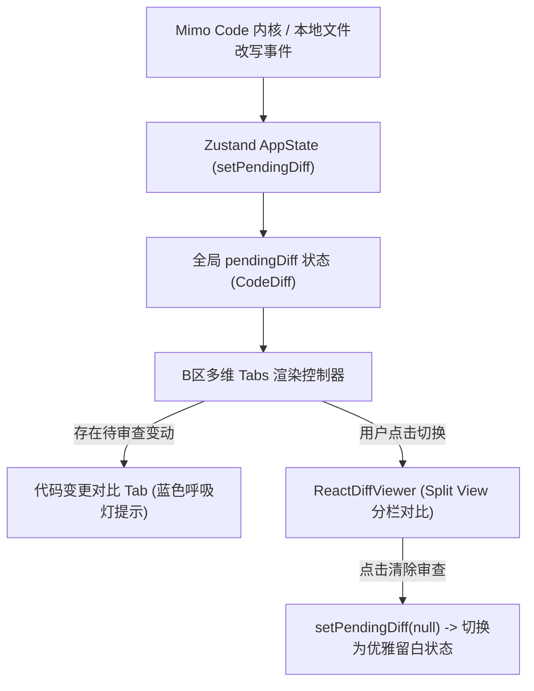

# 代码差异审查与 Git Diff 对比引擎集成规范

---

### [2026-06-15 19:05:00] 代码差异审查架构设计

## 架构设计概述

为了向用户直观、实时地展现 AI 智能体与 Mimo Code 内核对本地工作区文件所做的修改，我们在中央交互舱（B 区）实装了标准的 Git Diff 代码差异对比引擎。

> 该引擎支持在常规「对话流」与「代码变更对比 (Diff)」之间进行快速的多维标签切换，通过红绿背景高亮与左右分栏（Split View）形式直观反馈文件的每一次物理改写。

---

## 依赖关系与安装规范

项目采用以下核心依赖栈实现代码级差异呈现：

| 依赖库名称 | 版本号 | 类型 | 核心作用描述 |
| :--- | :--- | :--- | :--- |
| **`react-diff-viewer-continued`** | `^4.0.0` | 运行时依赖 | 轻量级、无依赖、支持 TypeScript 且支持 React 18+ 的分栏差异对比核心组件。 |

---

## 文件变动状态捕获管道 (Mutation Pipe)

文件变动信息通过全局 Zustand Store 进行捕获并以单一流向驱动 UI 渲染，拓扑控制链路如下：



### 1. 数据模型定义
在全局 store 中定义了明确的差异描述接口：
```typescript
export interface CodeDiff {
  fileName: string; // 发生修改的相对文件路径
  oldValue: string; // 修改前的原始文件内容
  newValue: string; // 修改后的最新文件内容
}
```

### 2. 交互与控制逻辑
- **Tabs 联动**：在 B 栏聊天区下方新增切换页签。如果检测到全局 store 中的 `pendingDiff` 处于非空状态，代码变更页签右侧会自动闪烁一个蓝色脉冲小圆点（`animate-pulse`），提示用户存在待审查的代码合并方案。
- **差异渲染器**：调用 `ReactDiffViewer`，强制设置 `splitView={true}` 以启用左右对称对比；自定义冷色调红绿透明度背景，防止刺眼：
  - 增加块颜色：`#e6ffec`，文字：`#1e8a3a`，单词高亮：`#acf2bd`。
  - 删除块颜色：`#ffebe9`，文字：`#b30919`，单词高亮：`#fdb8c0`。
- **清除控制**：内置「清除审查」按钮，用户点击后重置 `pendingDiff` 为 `null`，Diff 区自动无痛过渡到高含金量的极简插画留白面板，引导用户开展下一轮对话。
