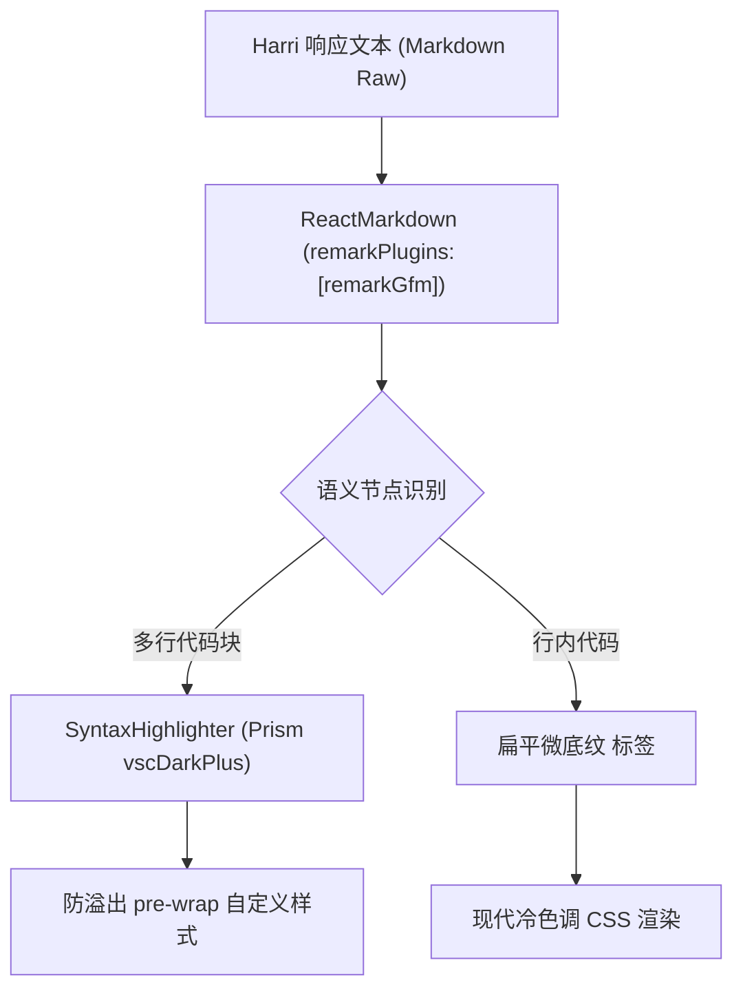

# 富文本解析与代码高亮渲染架构规范

---

### [2026-06-15 18:48:00] 富文本解析架构设计

## 架构设计概述

为了使智能体协作中枢的对话反馈信息（如代码方案、配置文件大纲、Markdown 文档）获得最佳的视觉呈现，我们在中央交互舱（B 区）实装了标准的 Markdown 语义解析与代码高亮渲染引擎。

> 该设计通过 React 渲染拦截器重构了常规文本输出，将 AST（抽象语法树）解析与定制的主题渲染管道进行无缝整合。

---

## 依赖关系与版本规范

项目采用以下核心依赖栈实现富文本及语法的精细化呈现：

| 依赖库名称 | 版本号 | 类型 | 核心作用描述 |
| :--- | :--- | :--- | :--- |
| **`react-markdown`** | `^10.1.0` | 运行时依赖 | 基于 AST 抽象语法树构建的 React 语义化标签转换核心。 |
| **`remark-gfm`** | `^4.0.1` | 运行时插件 | 提供 GitHub Flavored Markdown 规范支持（表格、任务列表、删除线等）。 |
| **`react-syntax-highlighter`** | `^16.1.1` | 运行时依赖 | 基于 Prism 语法引擎的代码块多色高亮渲染核心。 |
| **`@types/react-syntax-highlighter`** | `^15.5.13` | 开发时依赖 | 提供 TypeScript 强类型定义，防止编译阶段的隐式 `any` 警告。 |

---

## 核心渲染控制规范

### 1. 多行代码块高亮规范 (Code Blocks Rendering)
- **主题选型**：使用符合项目冷色调、防刺眼审美的 `vscDarkPlus` 暗色主题。
- **自定义视觉参数**：
  - 背景底色：物理锁死为 `#1e1e1e`（防闪烁极暗冷黑）。
  - 内边距：`1rem`（提供呼吸空间）。
  - 边角圆度：`0.5rem`（保持整机视觉圆角比例一致）。
  - 字号：`0.825rem`（兼具清晰度与高信息密度）。
- **溢出防御策略**：
  - 属性：`whiteSpace: "pre-wrap"`, `wordBreak: "break-all"`
  
> **排版安全结论**：通过在自定义样式对象中显式锁定 `pre-wrap` 与 `break-all`，从渲染层杜绝了因为超长代码（如巨型 URL、无空格的超长十六进制码）撑裂对话气泡及产生水平滚动条的崩溃级排版问题。

---

### 2. 行内代码扁平化渲染 (Inline Code Aesthetics)
- **视觉风格**：摒弃传统黑盒块，改用现代扁平化微底纹结构。
- **样式配置**：
  - 背景色：浅色模式 `bg-slate-100` / 深色模式 `dark:bg-slate-800`。
  - 前景色：`text-blue-600`（冷蓝色调高亮显眼）。
  - 文字参数：`font-mono text-xs font-semibold px-1.5 py-0.5 rounded`。
  
---

## 渲染器实现架构图

