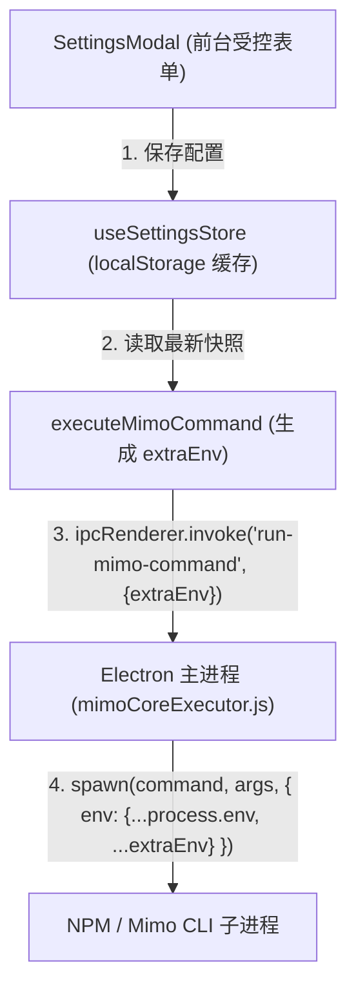

# 系统配置本地持久化与子进程注入规范

---

### [2026-06-15 19:08:00] 系统配置持久化方案

## 持久化设计概述

为了保障用户在退出或重启应用后无需重复配置 AI 服务，我们基于 Zustand 状态管理库构建了本地持久化配置层，并设计了与底层 CLI 子进程无缝对齐的环境变量安全注入通道。

> 任何在前台配置面板保存的参数都会即时写入本地存储，并在下一次启动本地编译、索引或诊断任务时，直接作为系统环境变量注入子进程。

---

## 本地缓存数据模型 (Data Schema)

- **缓存键名**：`mimo-settings-cache`
- **缓存媒介**：浏览器本地 localStorage
- **配置项字段定义**：

| 配置项键名 | 数据类型 | 默认初始值 | 核心功能与参数说明 |
| :--- | :--- | :--- | :--- |
| **`apiKey`** | `string` | `""` | 大语言模型访问凭证，支持在设置面板中进行明暗密文显隐切换保护。 |
| **`apiBaseUrl`** | `string` | `"https://api.openai.com/v1"` | 大模型 API 代理网关端点，支持自定义中转端点。 |
| **`defaultModel`** | `string` | `"gpt-4o"` | 多智能体中枢执行指令时默认调用的 AI 模型标识。 |
| **`maxTokens`** | `number` | `2048` | 大模型应答生成的最大上下文 tokens 硬性约束。 |
| **`defaultWorkspacePath`**| `string` | `""` | 指向本地待扫描和重构项目的绝对物理路径。 |

---

## 运行时进程注入机制 (Subprocess Env Propagation)

当用户在 B 区触发原生 Mimo 内核操作时，系统配置会经历以下安全投递链：

> **安全防护策略**：API Key 与访问地址等敏感配置在主进程的内存中被实时浅拷贝并覆写至子进程中，整个流程没有任何物理明文文件留底，保障了系统级别的敏感信息防刺探安全边界。

---

## UI 交互与视觉设计

- **触发入口**：点击左下角 Sidebar「系统设置」按钮，唤起全局配置 Modal 弹窗。
- **弹窗视觉**：采用现代微晶半透明背景遮罩（`backdrop-blur-xs`），面板延续冷色调极简风格，使用淡淡的 Slate 边框与输入框圆角，API 密钥输入栏集成一键式明暗密文隐藏控制。
